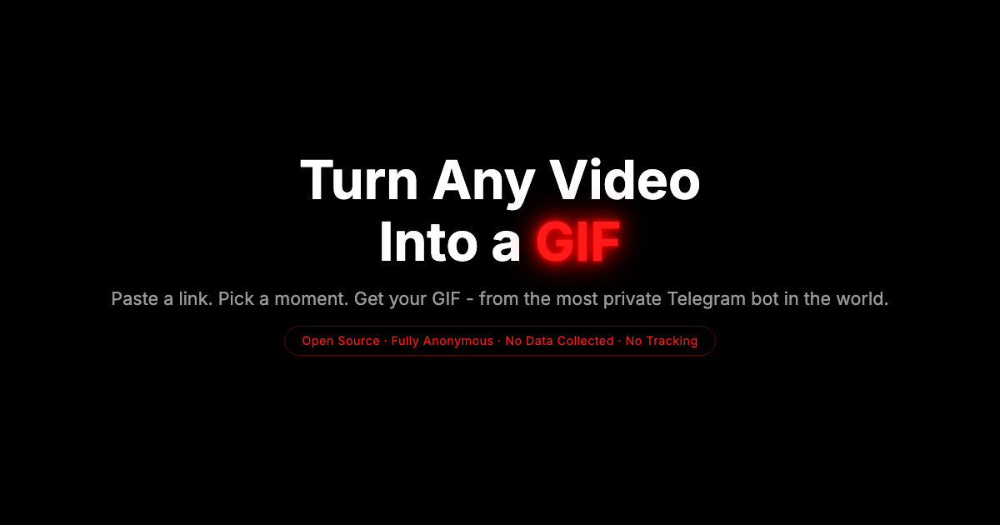

<div align="center">
  
</div>

# AnyGif

> Send a video URL. Set a start time and duration. Get a GIF. Pay with Telegram Stars.

<div align="center">

**[anygifbot.com](https://anygifbot.com)**

[](https://github.com/alexanderkranga/anygif/actions/workflows/check-unit-tests.yml)
[](https://github.com/alexanderkranga/anygif/actions/workflows/integration-tests.yml)
[](LICENSE)
[](https://t.me/anygif_bot)

</div>

---

<div align="center">
  
</div>

---

## Features

- Paste any video URL - YouTube, TikTok, Vimeo, X/Twitter, Dailymotion, Streamable, Imgur, and more
- Output is a silent MP4 clip - Telegram auto-loops it like a GIF
- x264, 24 FPS, max 480px longest side, 1-10 seconds
- Pay per GIF with Telegram Stars - no subscription, no account
- Privacy-first: no usernames, no URLs, no long-term data stored anywhere

## How it works

```
User → Telegram → Webhook Lambda → SQS → Worker Lambda → yt-dlp + ffmpeg → Telegram
```

Two Lambda functions are decoupled by an SQS queue. The **Webhook Lambda** receives Telegram updates, validates the request, and sends a payment invoice. Once the user pays, it enqueues a job. The **Worker Lambda** picks up the job, downloads the video with yt-dlp, transcodes it with ffmpeg, and sends the result back via Telegram.

Redis (ElastiCache) handles the session handoff between Lambdas. Sessions expire after 2 minutes and contain only what's needed to deliver the clip - no user data is retained after delivery.

## Privacy

- No PII in logs or SQS messages - only internal IDs, return codes, and file sizes
- Redis sessions expire in 2 minutes; no long-term storage exists anywhere
- No analytics, no third-party tracking, no names or URLs persisted
- Full privacy policy: [anygifbot.com/privacy](https://anygifbot.com/privacy)

## Self-hosting

**Prerequisites:** AWS account, Terraform, Docker, Telegram bot token.

1. Clone the repo
2. Add secrets to AWS Secrets Manager: `TELEGRAM_BOT_TOKEN`, `TELEGRAM_WEBHOOK_SECRET`, `DECODO_PROXY_URL`
3. Deploy infrastructure:
   ```bash
   cd infra && terraform init && terraform apply
   ```
4. Register the Telegram webhook:
   ```
   https://api.telegram.org/bot<TOKEN>/setWebhook?url=<API_GATEWAY_URL>
   ```

Push to `main` auto-deploys via GitHub Actions (see [`.github/workflows/deploy.yml`](.github/workflows/deploy.yml)).

## Development

```bash
# Install dependencies
pip install -r requirements.txt -r requirements-test.txt

# Unit tests
bin/test.sh

# Integration tests (requires yt-dlp, ffmpeg, proxy)
DECODO_PROXY_URL=... bin/test.sh --integration

# Docker build
docker build --platform linux/amd64 -t anygif .
```

## License

Apache 2.0 - see [LICENSE](LICENSE)
